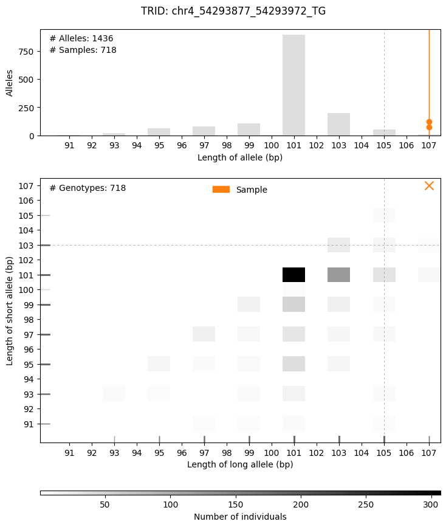
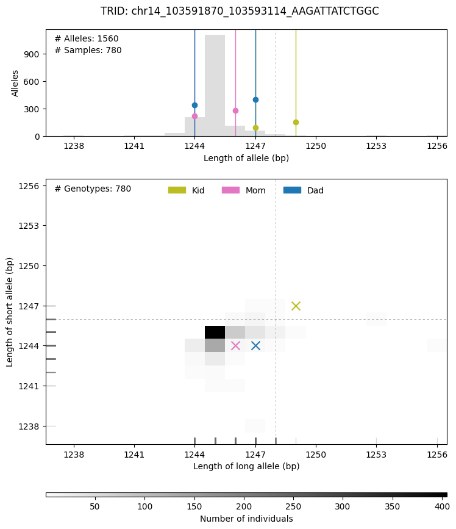

# Interpreting TRGT Annotation <!-- omit in toc -->

- [Output Files](#output-files)
- [Understanding `.db` files](#understanding-db-files)
- [Understanding `.tsv` files](#understanding-tsv-files)
- [Plots](#plots)

## Output Files

The output files include the following:

| File | Description | Option |
| --- | --- | --- |
| [`<prefix>.db`](#understanding-db-files) | SQLite database containing all variants and annotations | Default |
| [`<prefix>.tsv`](#understanding-tsv-files) | Summarized TSV version of `<prefix.db>` | `--tsv` |
| [`<prefix>.filtered.db`](#understanding-db-files) | SQLite database containing only variants with outlier alleles (if `--annotation-db` is used) and variants with pathogenic/premutation alleles (if `--pathogenic-tsv` is used) | `--filter` |
| [`<prefix>.pathogenic.tsv`](#understanding-tsv-files) | TSV output for only those loci matching annotations in `--pathogenic-tsv` | `--pathogenic-tsv <FILE> --tsv` |
| [`<prefix>.filtered.tsv`](#understanding-tsv-files) | Summarized TSV version of `<prefix>.filtered.db` | `--filter --tsv` |
| [`<prefix>_plots/<prefix>.*.png`](#plots) | Plots of repeat allele lengths and motif counts | `--plot` |

## Understanding `.db` files

The SQLite database contains all the information from the VCF file, as well as all additional annotations. It is a useful format for querying the data using SQL or browsing the data interactively using a tool like [DB Browser for SQLite](https://sqlitebrowser.org/).

However, unless you are familiar with SQLite and associated tools, you may find it easier to work with the `<prefix>.filtered.tsv` or `<prefix>.pathogenic.tsv` files, which contain a subset of the data that is most relevant for interpreting the results.

## Understanding `.tsv` files

A description of all possible columns can be found in [trgt_columns.tsv](../src/humanatee/data/trgt_columns.tsv). This file lists the column name (col1), a description (col2), and the source of the data (col3). The source of the data can be one of the following:

| Source | Option |
| --- | --- |
| default | A default output column |
| denovo | `--denovo` |
| pathogenic-tsv | `--pathogenic-tsv` |
| annotation-db | `--annotation-db` |
| dropouts | `--dropouts` |

The most important columns are `priority_rank`, `flags`, and `filters`, which are used to prioritize the variants. The `priority_rank` column is a numeric value that is used to sort variants, with lower values indicating higher priority (`1`=highest priority, `4`=lowest priority).

The `priority_rank` is determined from both the `flags` and `filters` columns. Put simply, certain flags can increase a variant's priority, while certain filters can decrease a variant's priority. For example, a variant with a pathogenic or premutation flag will always be ranked as highest priority (priority_rank 1). On the other hand, a variant that is a population outlier but has low coverage (shown as low SD or a coverage dropout) will be lowest priority (priority_rank 4).

The following table shows the specific flags and filters that can affect the `priority_rank`. By default, the `priority_rank` is set to `4` for all loci that are either a pathogenic locus or expanded compared to the population and is adjusted based on the presence of these flags and filters.

| Flag/Filter | Label | Description | Effect on priority rank |
| --- | --- | --- | --- |
| Flag | `pathogenic` | At least one allele has a motif count (MC) greater than the defined pathogenic threshold | Sets priority rank to `1` despite all other flags/filters |
| Flag | `premutation` | At least one allele has a motif count (MC) between the defined normal and pathogenic thresholds | Sets priority rank to `1` despite all other flags/filters |
| Filter | `SD` | At least one allele has insufficient spanning depth (SD) | Sets priority rank to `4` despite all other flags/filters except `pathogenic` or `premutation` |
| Filter | `coverage_dropout`|Locus was determined to be a haplotype or full coverage dropout from `--droputs` input | Decreases to `4` despite all other flags/filters except `pathogenic` or `premutation` |
| Flag | `mode=denovo`, `mode=biallelic`, `mode=hemizygous` | Indicates the mode of inheritance | `-1` |
| Filter | `allele_ratio`, `child_ratio`, `father_dropout`, `mother_dropout` | Quality metrics if `mode=denovo` flag is present | `+1` |
| Flag | `impact=exon`, `misc=population_monomorphic`, `misc=large_expansion` | Repeat overlaps a gene exon, or miscellaneous flags  | `-1` |
| Flag | `phenotype=<rank>/<number of genes with nonzero phenotype score>` | Sample phenotype score rank, only flagged if in top 10% of nonzero phenotype scores | `-1` |

## Plots

Population allele histograms are produced if the `--annotation-db` and `--plot` options are used. These plots show the distribution of allele lengths for each repeat allele in the population database compared to the sample allele lengths (and parents when `--denovo` is used). Plots are only generated when `priority_rank ≥ 2`.

An example singleton plot of a dinucleotide repeat:

An example trio plot showing a de novo repeat expansion:

The dotted lines represent the 99th percentile cutoffs derived from the population, used to determine whether an allele is an outlier.
